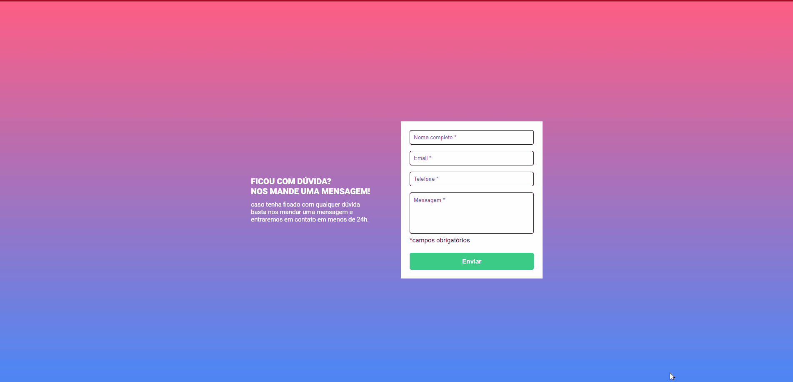
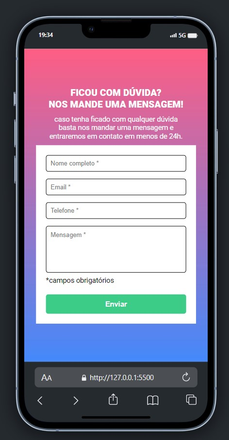

# Validação de Formulário

Projeto realizado para conclusão do desafio da quest do curso DevQuest - Dev em Dobro, onde fui desafiado a recriar um layout de um formulário simples do figma disponibilizado, e também a desenvolver uma validação para o mesmo, onde caso os campos não fossem preenchidos, deve aparecer a baixo do campo, um aviso de campo obrigátorio e a as bordas em vermelho, e quando o campo for preenchido, a borda se tornar verde!!

### Desktop

### Responsivo

## Tecnologias utilizadas
- HTML
- CSS
- JavaScript

## Coisas que aprendi
1 - Aprendi a pensar melhor de forma lógica para buscar uma solução para a quest proposta.

2 - Como criar de forma mais semântica um formulário com HTML.

3 - A como procurar através de pesquisas seja na internet, documentação, vídeos, tutoriais ou em códigos de outra pessoa a aencontrar a solução para o meu problema.

## Onde senti dificuldade
Senti dificuladade na hora de passar o que estava na minha cabeça para o código, pois em minha cabeça funcionaria de um jeito, e quando testei não funcionou.
